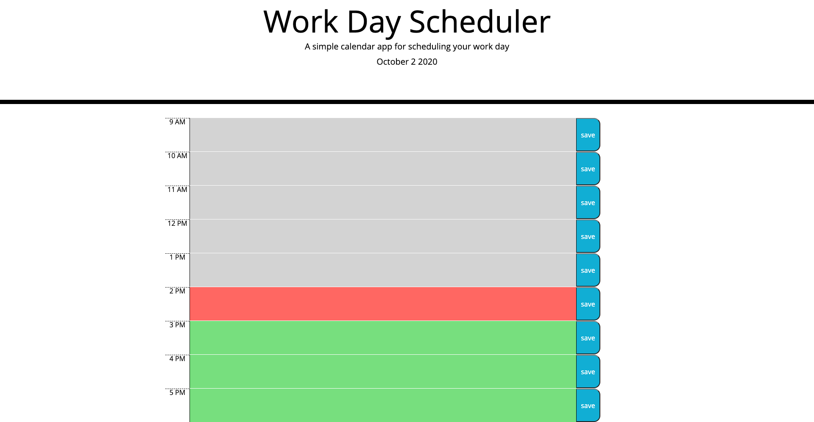

# dayPlannerHW

## Description

Using jQuery, I created an application that acts as a day planner for the user. The user can input an event, and save it to local storage so it will stay. The code also uses time, and will show past, present, and future events.

## Usage

Click on an hour to input an event, and hit save to save that event to local storage. If you refresh the page, it'll stay there.

## Link to Application

https://tmessall.github.io/dayPlannerHW/